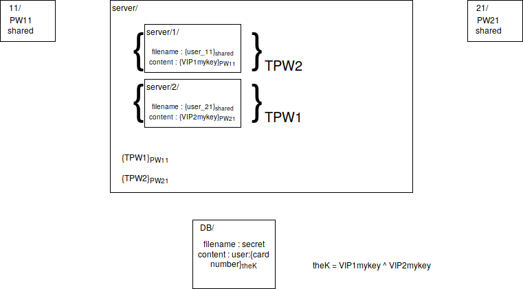

# Crypto_M2

Just launch ```./crypto``` and use the ```init``` command inside the main loop in order to initialize the POC environment.

You can use the following commands :
  - ```init``` : use it once (and only once) in order to create keys and passwords for two managers. After that, the functions (add, get, add_user, remove_user) can be called.

  - ```add``` : asks for the name of a client, then for his credit card number, encrypts and saves it in the DB folder.

  - ```get``` : asks for the name of a client and display all this client's credit card numbers.

  - ```add_user``` : asks for a user ID (simple digit except 1, reserved for managers only), then for his group number.

  - ```remove_user``` : asks for a user ID and then delete all files related to this user.

  - Don't forget to exec ```exit_all``` before exiting


Illustrated example :
--
- Init launched. The "xor keys" (VIP1mykey and VIP2mykey) are generated. The PW11 and the PW21 are generated, as the TPW1 and the TPW2 are. Then, a shared password "shared" is generated. With the passwords (PW11,PW21), the "temp keys" (TPW1,TPW2) are encrypted and stored on the server. The xor keys are respectively encrypted by the passwords of each group. Then, the files names are encrypted by the shared password and put on the server in two different directories (1 and 2, one for each group). Finally, the directories are "crossed encrypted", which means the directory 1 is encrypted by the group 2 (the TPW2 key) and the directory 2 is encrypted by the group 1 (the TPW1 key).

- Add launched : a name (like john.doe) and a card number are given, and those are put in the DB. Before that, the xor keys are xored to construct the key "theK" which encrypts the card number.

- Get launched : a name is given and all the codes which match (after decrypting) with the name are displayed.

- Add_user launched : an ID (example : 4) and a group (example : 1) are given. The PW14 is generated. With the password (PW14), the temp key (TPW1) is encrypted and stored on the server. The xor key (VIP1mykey) is encrypted by the password. Then, the file name (in this case, user_14) is encrypted by the shared password and put on the server in the directory (in this case, 1). Finally, the directory is encrypted. The user is added.

- Remove_user launched : an ID (example : 4) and a group (example : 1) are given. The xor file is found in the directory (in this case, 1) then deleted. The temp key, encrypted by the PW14, is deleted. Finally, the directory "14" is deleted. The user is removed.

- Exit_all launched : all the keys and files and other stuff are removed. Only the script remains.


